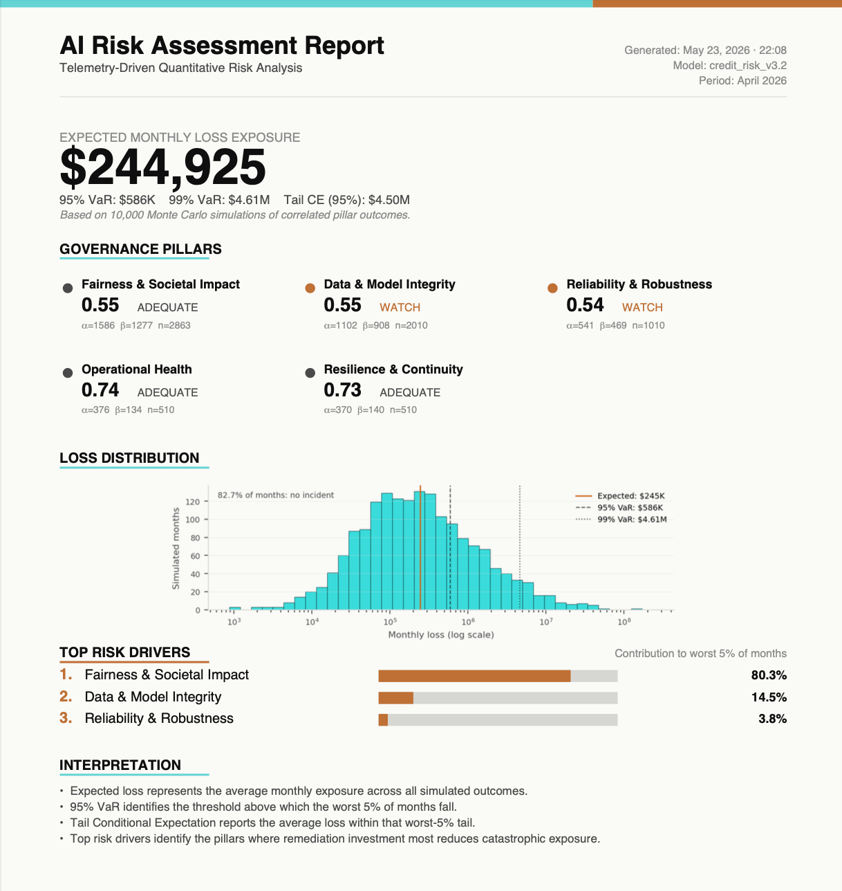

# Quantifying AI Risk

**Building a Telemetry-Driven Risk Scoring Engine for Production AI**

Companion repository for the O'Reilly Live Training Course delivered on June 1, 2026, taught by [Suneeta Modekurty](https://www.linkedin.com/in/smodekurty).

---

## What you will build

Over three hours, you will build a complete pipeline that takes a production AI system from "we hope it is behaving" to "we can defend its behavior to a regulator, an executive, and a customer." The pipeline has three stages.

**Hour 1: Telemetry.** Instrument a production model so that it emits six governance signals: decision, confidence, latency, drift, fairness, and operational health. Each signal is decision-bound, timestamped, and stored in a tamper-evident event sink.

**Hour 2: Bayesian inference.** Turn the telemetry stream into per-pillar posterior distributions, each with its own credible interval. Skeptical priors. Severity-weighted likelihoods. Per-pillar updates that preserve the evidence each regulatory framework actually asks for.

**Hour 3: Monte Carlo simulation.** Translate the posteriors into a financial risk distribution. Compute expected loss, 95% Value at Risk, and 95% Tail Conditional Expectation. Run sensitivity analysis to find which pillars drive catastrophic tail risk.

By the end, you have a working measurement-and-inference pipeline you can run against your own systems.

---

## What you will walk away with

When the third notebook finishes, the pipeline writes a one-page PDF report to your local folder. The report shows:

- The expected monthly loss exposure as the headline number
- 95% and 99% Value at Risk, plus Tail Conditional Expectation
- The current state of all five governance pillars with posterior scores and confidence intervals
- The Monte Carlo loss distribution showing simulated outcomes
- The top three risk drivers ranked by contribution to the worst 5% of months
- A regulatory mapping to the specific EU AI Act articles, NIST AI RMF measures, and ISO 42001 clauses your pipeline addresses

This is the document you would hand a CFO, attach to a board memo, or present to a regulator. The methodology produces an artifact, not just a number.



---

## Notebooks

Each notebook can run on your local machine or in Google Colab. Click the Colab badge to open the notebook in your browser without any setup.

| Hour | Notebook | Open in Colab |
|------|----------|---------------|
| Hour 1 | [`notebooks/01_telemetry.ipynb`](notebooks/01_telemetry.ipynb) | [](https://colab.research.google.com/github/sanjeevaniai/quantifying-ai-risk/blob/main/notebooks/01_telemetry.ipynb) |
| Hour 2 | [`notebooks/02_bayesian_scoring.ipynb`](notebooks/02_bayesian_scoring.ipynb) | [](https://colab.research.google.com/github/sanjeevaniai/quantifying-ai-risk/blob/main/notebooks/02_bayesian_scoring.ipynb) |
| Hour 3 | [`notebooks/03_monte_carlo.ipynb`](notebooks/03_monte_carlo.ipynb) | [](https://colab.research.google.com/github/sanjeevaniai/quantifying-ai-risk/blob/main/notebooks/03_monte_carlo.ipynb) |

The notebooks are designed to run in order. Notebook 1 emits telemetry events that Notebook 2 reads. Notebook 2 produces pillar posterior distributions that Notebook 3 samples from. Notebook 3 generates the final PDF report.

---

## Setup: Local

To run the notebooks on your own machine:

```bash
git clone https://github.com/sanjeevaniai/quantifying-ai-risk.git
cd quantifying-ai-risk
python -m venv .venv
source .venv/bin/activate          # macOS / Linux
# .venv\Scripts\activate            # Windows PowerShell
pip install -r requirements.txt
python setup_check.py
jupyter notebook notebooks/01_telemetry.ipynb
```

**Requirements:**

- Python 3.10 or newer
- Roughly 500 MB of disk space for dependencies
- A web browser for Jupyter

`setup_check.py` verifies your Python version and confirms that every dependency imports cleanly. Run it before the course starts so that any environment issues are resolved before Hour 1.

---

## Setup: Colab (no install required)

Click any of the **Open in Colab** badges above. Colab handles Python, dependencies, and Jupyter for you. The first cell of each notebook installs the few packages that Colab does not have by default. Notebooks 2 and 3 read files written by earlier notebooks, so on Colab you will need to either run all three notebooks in the same session or re-upload the intermediate files between sessions.

---

## Repository contents

```
quantifying-ai-risk/
├── README.md                       This file
├── LICENSE                         MIT
├── requirements.txt                Pinned Python dependencies
├── setup_check.py                  Environment verification script
├── .gitignore                      Python and Jupyter conventions
├── notebooks/                      The three course notebooks
│   ├── 01_telemetry.ipynb          Hour 1, instrumenting a model
│   ├── 02_bayesian_scoring.ipynb   Hour 2, per-pillar posteriors
│   └── 03_monte_carlo.ipynb        Hour 3, financial risk simulation
├── utils/                          Helper modules
│   ├── __init__.py
│   └── report_generator.py         One-page PDF report builder
├── docs/                           Documentation assets
│   └── sample_report.png           Preview of the generated report
└── data/                           Generated by the notebooks at runtime
    └── .gitkeep                    (placeholder, files written here are gitignored)
```


---

## How to use this repository after the course

The methodology in this course is a starting point, not a finished product. Three suggested next steps:

1. **Run the three notebooks against one of your own systems.** Even a small one. Even with synthetic loss numbers at first. The exercise of going from zero to a working pipeline on real telemetry is what locks the methodology in.
2. **Extend the schema.** The six signals captured here are the minimum evidentiary foundation. Your industry may require additional signals. Add them using the same per-pillar posterior pattern.
3. **Calibrate the loss functions.** The loss functions in Notebook 3 are deliberately simple. Production calibration uses your own incident history and your own legal exposure assessments. The shape of the model is right. The numbers are illustrative.

---

## Recommended reading

Books on the O'Reilly platform that pair well with this course. The first four extend the technical methods built here. The last two extend the operational context for putting this into production.

- **[Think Bayes, 2nd Edition](https://learning.oreilly.com/library/view/think-bayes-2nd/9781492089452/)** by Allen B. Downey. The gentlest path into the Bayesian reasoning used in Hour 2. Read this if the prior and posterior intuition still feels fuzzy.
- **[Python for Data Analysis, 3rd Edition](https://learning.oreilly.com/library/view/python-for-data/9781098104023/)** by Wes McKinney. The canonical reference for working with telemetry data at scale, once event volume outgrows the patterns in this course.
- **[Designing Machine Learning Systems](https://learning.oreilly.com/library/view/designing-machine-learning/9781098107956/)** by Chip Huyen. System-level thinking about ML in production. The complementary lens to what this course builds. Where this course quantifies risk, that book maps the surface area where risk lives.
- **[Reliable Machine Learning](https://learning.oreilly.com/library/view/reliable-machine-learning/9781098106218/)** by Cathy Chen and colleagues. Applies SRE discipline to ML systems. Pairs naturally with the operational health signal from Hour 1.
- **[Practical MLOps](https://learning.oreilly.com/library/view/practical-mlops/9781098103002/)** by Noah Gift and Alfredo Deza. The CI/CD and deployment context. Useful when wiring the methodology from this course into your own pipelines.

---

## Stay connected

**Newsletter.** [A.I.N.S.T.E.I.N.](https://ainstein.sanjeevaniai.com) on Substack. Long-form essays on AI governance, telemetry, and quantitative trust scoring.

**LinkedIn.** [linkedin.com/in/smodekurty](https://www.linkedin.com/in/smodekurty). Send a connection request and mention this course.

**Practice.** The methodology taught in this course is operationalized as METRIS, an AI Trust Posture Management platform built by SANJEEVANI AI. [sanjeevaniai.com](https://sanjeevaniai.com)

---

## License

MIT. See [LICENSE](LICENSE).

You are free to use this code in your own work, including in commercial projects, with attribution. If you build something interesting on top of it, the author would love to hear about it.

---

*This course is a one-time live event on O'Reilly's platform. The notebooks and methodology in this repository are the durable artifacts.*